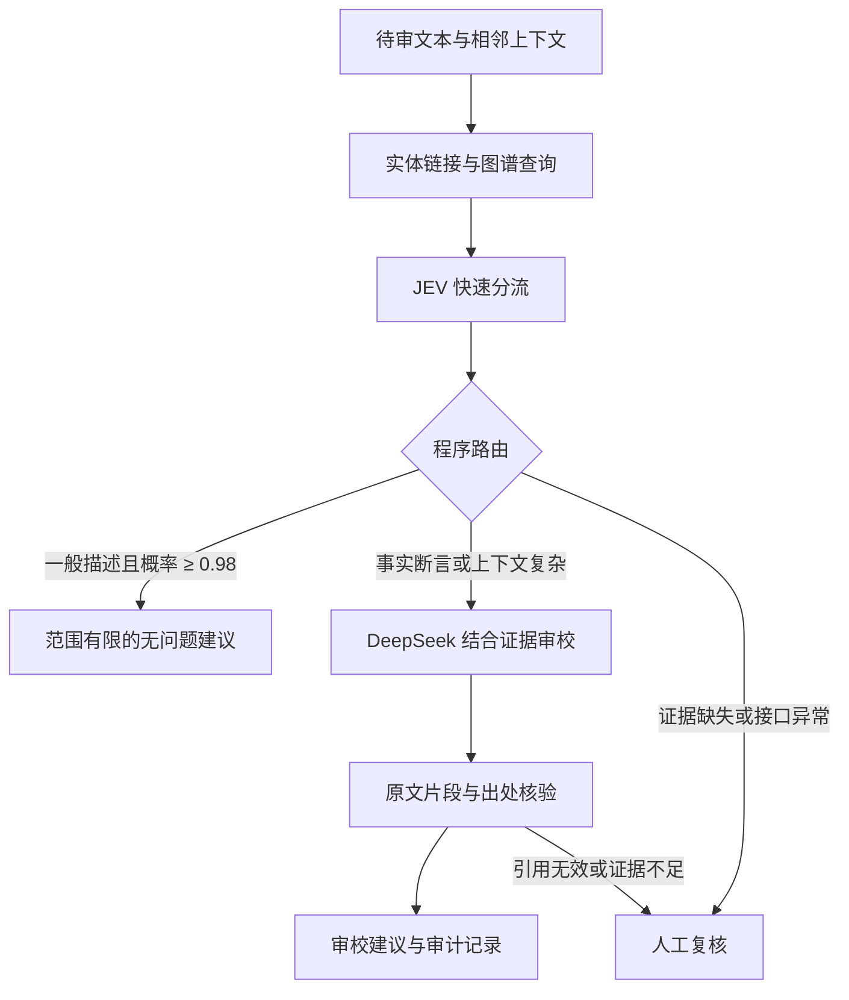

# 组件与数据流

本原型的任务是教育内容的事实与引用辅助审校。System 1/2 只是工作分工的类比，不等同人类脑区，也不意味着模型有通用规划能力。

图谱是模型外部的证据层：实体别名链接→最多两跳关系遍历→连接候选中按原句词片段匹配排序。未匹配实体时不会假造三元组，没有检索到不能推出原文错误。这里是真实图结构的轻量实现，无需 Neo4j 服务；JSON 为可审阅源，SQLite 为可导出的查询存储。

每个事实包含主语、谓语、宾语、短原文、文档 ID、来源 URL、条款定位、资料日期、有效期和核验状态。事件发生时间、生效时间和文章发表时间使用不同谓语。没有建立未知有效期的时间证明能力，不推断未来/历史适用性。

| 模块 | 职责 | 边界 |
|---|---|---|
| JEV | 将文本路由到 routine/deep/human，返回各选项概率 | 概率未校准，不替代事实证明 |
| 知识图谱 | 提供规范、定义、日期与可追溯依据 | 只有 13 条关系，未覆盖整个领域 |
| DeepSeek | 结合上下文判断错误并生成建议 | 可能误读、漏检或引用错误 |
| Harness | 分块、检索、强制深审规则、预算、缓存、异常与引用验证 | 路由由代码执行，模型不控制程序权限 |
| 审计记忆 | SQLite 持久保存结果及未核验状态 | 不自动成为权威知识，不把模型猜测视为事实 |
| 人工 | 处理未证实断言与最终审定 | 当前没有真实人工参与评测 |

`issue` 表示建议修订并人工审定，`insufficient` 表示当前证据不足或流程失败，`no_issue` 表示本次证据范围未发现问题。即便是 `no_issue`，也没有全文合规认证。

JEV 后置于图谱检索，可利用小规模证据；这样 JEV 不是只凭孤立语句做立场判断。引用、文件名称、日期和规范性词触发便宜的程序检查，绕过快速路由的直接放行。多块文本有相邻上下文时也强制深度审校。

如果以后换 BERT，只需保留 `fast()` 的结构化接口，由专门训练的三分类或多标签模型提供分数；必须重新评测、校准阈值。未训练的基础 BERT 不会自动理解现有 JEV 问题标准。

## 数据与缓存隔离

gold label 和 required evidence 只在评测器使用，不传入模型。模型可以看到待审文本、图谱公开证据和固定任务描述。缓存键来自完整请求；不含标签或案例 ID。缓存共享使图谱方案和混合方案对相同深审请求使用同一份响应，降低重复费用，也意味着两方案的深审输出不是独立重复实验。

缓存与逐次日志持久保存，支持失败追踪。不重试 HTTP 错误；401/402/403/404、连续三次失败或预算上限停止。费用统计使用 OpenRouter 返回费用与 DeepSeek 峰时单价上限估算，不能代替账户账单。中断/超时可能已计费。
